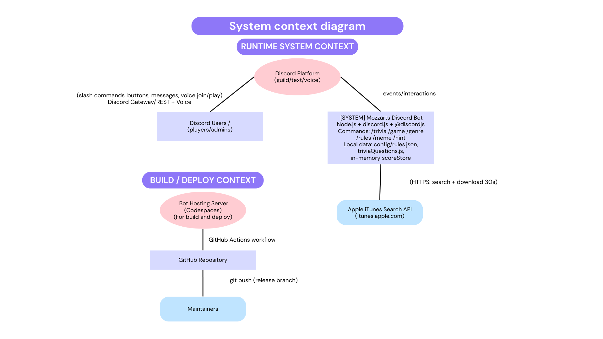

# Architecture of our bot

## **Data-flow diagram (David Hochberg):**
Figure 1.0 shows the data and information that will flow between the different elements of our bot.

<ins> **Figure 1.0** </ins>

## **Activity Diagram(Will Sarmiento): The gameplay loop**
Description:

The activity diagram shows the flow of activity that are done to play the music trivia. Once /trivia is run, this prompts the user to select a difficulty which if none are chosen, a message to remind the user will be given so that they may choose a difficulty, depending on the choice the instructions given will be different however they will still be instructions which the user will follow to maximize the points they can gain. 
In Figure 1.1 below, it shows the activities our bot goes through when going through a single gameplay loop. This flow of activity is what we hope to achieve by the end of development.

<ins> **Figure 1.1** </ins>

Architecture importance: 
This diagram is necessary for a clear view of how the music trivia game will run. 

## **Network Diagram (Khoa Vo):**
Figure 1.2 shows the connections and nodes for the network of the bot.

<ins> **Figure 1.2** </ins>

https://raw.githubusercontent.com/CSS360-2026-Winter/Mozzarts/refs/heads/main/images/khoa-network-diagram.png

## **Use-case Diagram: ** 
In Figure 1.3 below, it shows the fundamental blue print of our system and how each actor interacts with it.

<ins> **Figure 1.3** </ins>

## **Class Diagram (ArteenR):**
Figure 1.4 shows the connections between the major classes and how they interact within the music trivia bot system.

<ins> **Figure 1.4** </ins>

## **Class Diagram (Jayden):**
Figure 1.5 shows the connections between all external systems and how they interact with the music trivia bot system.

<ins> **Figure 1.5** </ins>

